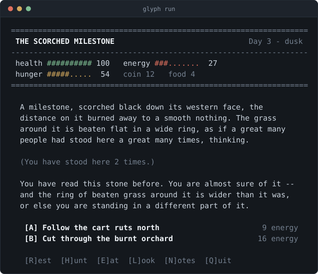

# The Road That Bends Back

A terminal survival game about a road that does not go where roads go.
Written in [Glyph](https://www.npmjs.com/package/@glyphlang/glyph).

<p align="center">
  
</p>

<p align="center">
  <em>The second arrival at the milestone. The road did not take you anywhere new &mdash;<br>
  and that is the point. Stand here once more and the stone gives up a word.</em>
</p>

```sh
npm install
glyph run            # play
glyph run -- --seed 7   # a different set of dice
glyph run -- --forget   # burn the ledger and forget everything
```

## What it is

You walk east out of Vareska. You choose **A** or **B**, over and over.
Some roads go somewhere. Some roads hand you back to a place you have
already stood, three days hungrier and forty energy poorer.

That is not a bug in the road. It is the puzzle.

## The design

**The world is a directed graph, not a branching tree.** Most choose-your-own
games are trees: every choice widens the world and you never see a node twice.
Here there are cycles, and being sent back is a *tax*, not a game-over.

Three places on the map can be arrived at from more than one direction: the
scorched milestone, the ferry landing, and the ring of nine stones. Each one
says nothing the first time, says something uneasy the second time, and gives
up a **word** the third time. The door at Hollow End wants the three words in
their own order.

So the loop is not a punishment you endure — it is the only way to get the
answer. The player who understands the graph can solve the door. The player
who brute-forces their way east arrives with nothing to say to it.

**Knowledge is the real save file.** Death is cheap: you wake in Vareska with
your pack reset and the words gone from your notes — but *you* still know them.
A returning player can walk straight to the door and speak three words they
learned in a previous life, and the game acknowledges it. The first crossing in
testing took 27 in-game days. The second took nine steps.

## The systems

| Stat | Drains from | Restored by |
|---|---|---|
| Energy | every road, every effort | eating, resting |
| Hunger | the passing of time | eating |
| Health | being exhausted, being starved | resting |
| Coin | ferry fares, food | working |

Two ways to eat, trading different currencies:

- **Buy food** — costs coin, costs almost no energy, only in a market.
- **Hunt** — free, costs 22 energy, only in wild country, and it can fail.

The odds of a hunt are read off your legs *before* you spend them: a tired
hunter is a bad hunter. That is how one bad watch becomes a bad week, and it is
why the bread you didn't buy in Vareska is a decision you get to revisit.

The ferryman wants three coin. If you cross the river with an empty purse you
are not stranded — you can wade the mire instead — but it will cost you far
more than three coin's worth of walking.

## Commands

`A` / `B` take the two roads. `E`at, `H`unt, `R`est, `W`ork, `F`ood (buy),
`L`ook, `N`otes, `Q`uit.

## Layout

```
src/
  types.glyph     core types and a fresh Game
  world.glyph     the road graph -- 20 places, all the prose
  rules.glyph     energy, hunger, health, time, arrival
  economy.glyph   hunting, buying, working, resting
  puzzle.glyph    the three words and the door
  render.glyph    word-wrap, meters, colour
  save.glyph      the ledger that survives death
  main.glyph      the turn loop
```

Content is data: adding a place is an entry in `world.glyph`'s `PLACES`, and
making it a fourth cycle is one more entry in `puzzle.glyph`'s `FRAGMENTS`.

`glyph check src` runs 14 inline `@example` tests with the build.

## The field report

Writing this was also a dogfooding exercise. [`GLYPH-JOURNAL.md`](GLYPH-JOURNAL.md)
is a field report on building in Glyph with no prior knowledge of it: eleven
findings with verbatim diagnostics, one of them corrected after review, re-tested
against every release from 0.1.93 to 0.1.106. [`field-report.html`](field-report.html)
is the same content, styled — open it in a browser.
